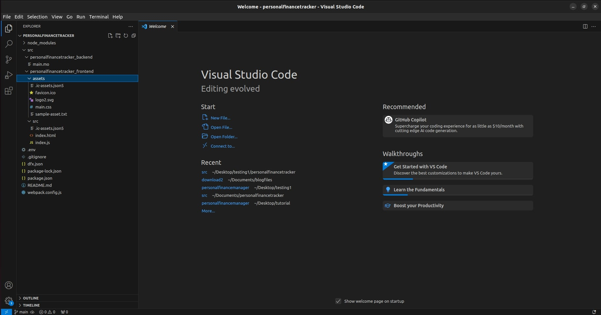
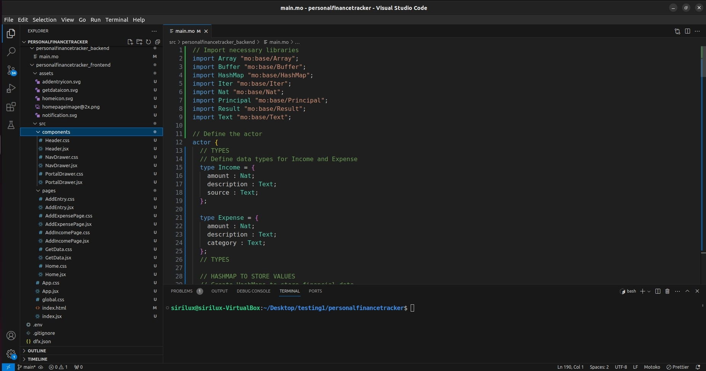
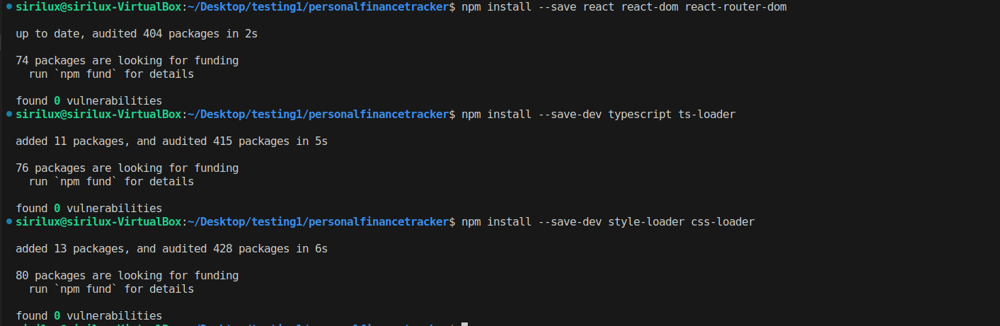
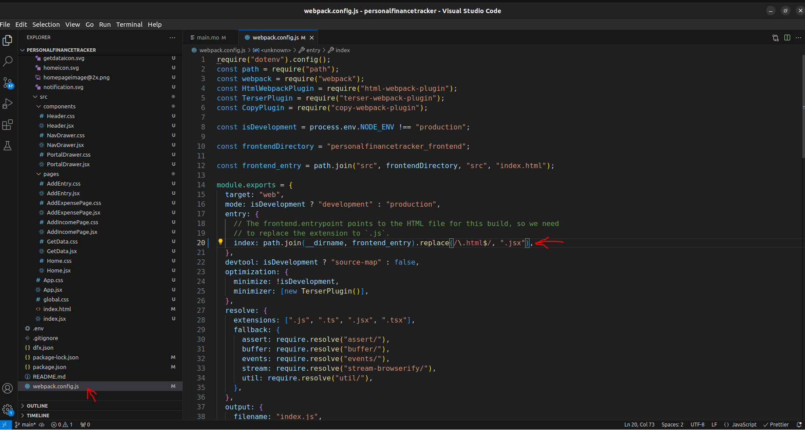
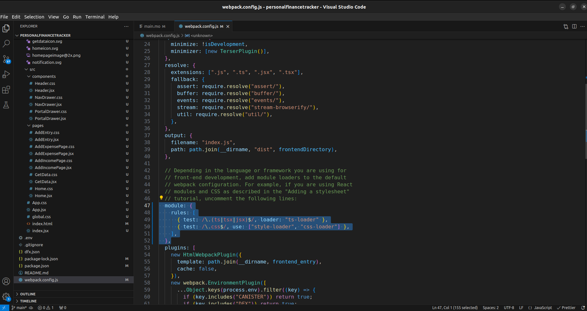
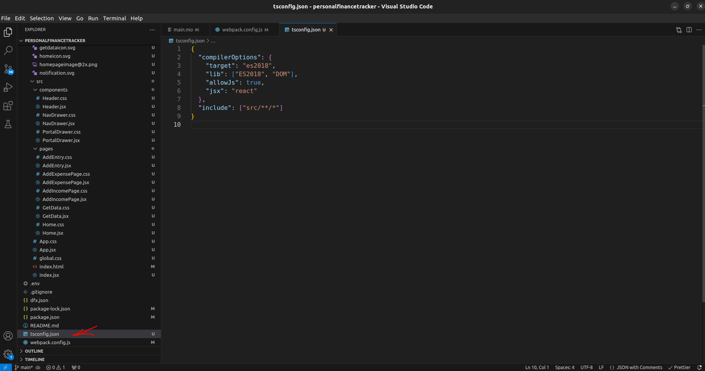
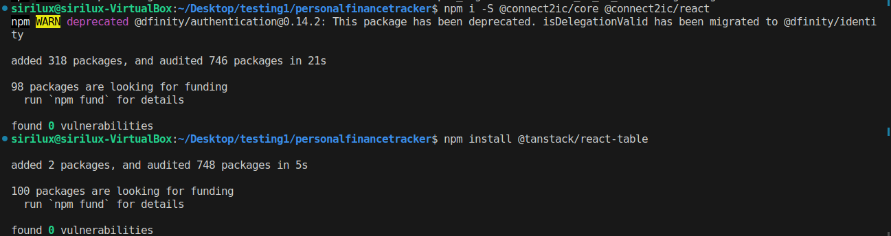
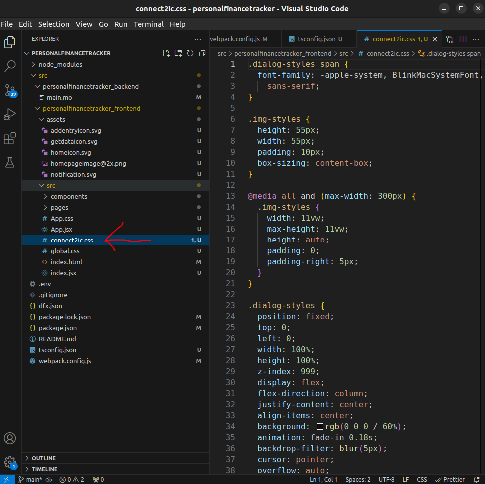
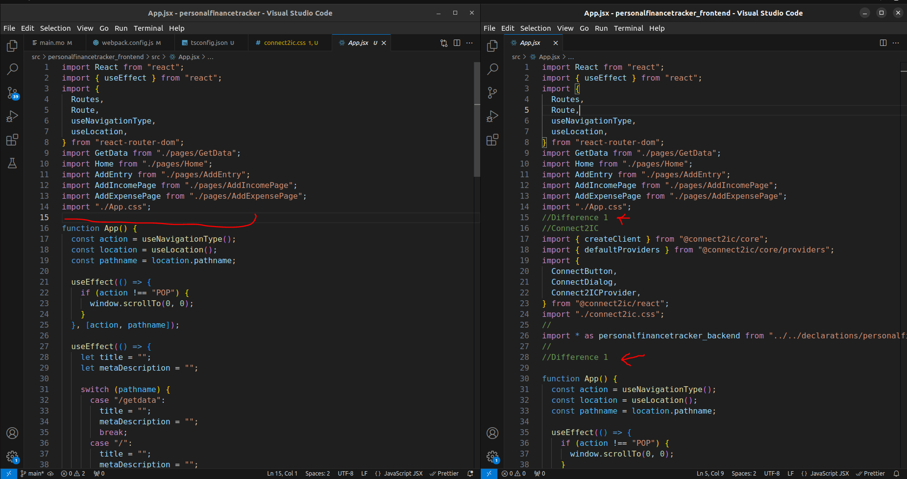

# Creating a Personal Finance Tracker Dapp on the Internet Computer (ICP)

In this tutorial, we will guide you through the process of creating a Personal Finance Tracker decentralized application (Dapp) on the Internet Computer (ICP). The Dapp will consist of both a backend written in Motoko and a frontend using React. We will use Connect2IC to connect the frontend with the backend.

**Prerequisites:**

Before we begin, make sure you have the following installed and set up:

1. **DFX (Internet Computer Development Kit):** Follow the [DFX installation tutorial](https://docs.google.com/document/d/1wGVVqlXZE8rzlLQOl4P4CkUP9dCVqIGc8iLTBthwinc/edit?usp=sharing) to set up DFX for development.

2. **Redeem Cycles:** You need cycles to deploy your Dapp on the Internet Computer. Follow the [link to redeem coupon](https://internetcomputer.org/docs/current/developer-docs/setup/cycles/cycles-faucet) for cycles.

## Step 1: Create a New Project

First, create a new project using the following commands:

```shell
dfx new personalfinancetracker
cd personalfinancetracker
```

Now open the folder in VS Code
You will get followed folder structure



## Step 2: Set Up the Backend

Replace the existing Motoko code in main.mo file present in personalfinancetracker_backend folder with the provided Motoko code. This code defines the backend logic for managing income, expenses, and user balances.

```javascript
// Import necessary libraries
import Array "mo:base/Array";
import Buffer "mo:base/Buffer";
import HashMap "mo:base/HashMap";
import Iter "mo:base/Iter";
import Nat "mo:base/Nat";
import Principal "mo:base/Principal";
import Result "mo:base/Result";
import Text "mo:base/Text";

// Define the actor
actor {
  // TYPES
  // Define data types for Income and Expense
  type Income = {
    amount : Nat;
    description : Text;
    source : Text;
  };

  type Expense = {
    amount : Nat;
    description : Text;
    category : Text;
  };
  // TYPES

  // HASHMAP TO STORE VALUES
  // Create HashMaps to store financial data
  let balanceValueHashMap = HashMap.HashMap<Principal, Nat>(0, Principal.equal, Principal.hash);
  let incomeHashMap = HashMap.HashMap<Principal, [Income]>(0, Principal.equal, Principal.hash);
  let expenseValueHashMap = HashMap.HashMap<Principal, Nat>(0, Principal.equal, Principal.hash);
  let expensesHashMap = HashMap.HashMap<Principal, [Expense]>(0, Principal.equal, Principal.hash);
  // HASHMAP TO STORE VALUES

  // Function to add income
  public shared ({ caller }) func addIncome(amount : Nat, inputInfo : Text, source : Text) : async Result.Result<Text, Text> {
    // Check if the caller is anonymous
    if (Principal.isAnonymous(caller)) {
      return #err("Anonymous persons can't register, please login with wallet or internet identity");
    };

    // Check if the user has existing income
    switch (incomeHashMap.get(caller)) {
      case (?array) {
        // If the user has previous income data, add the new income to the array
        let newIncome : Income = {
          amount = amount;
          description = inputInfo;
          source = source;
        };
        let tempBuffer = Buffer.fromArray<Income>(array);
        tempBuffer.add(newIncome);
        incomeHashMap.put(caller, Buffer.toArray(tempBuffer));

        // Update the user's balance
        switch (balanceValueHashMap.get(caller)) {
          case (?value) { balanceValueHashMap.put(caller, amount + value) };
          case (null) {};
        };
        #ok("Successfully added your income");
      };
      case (null) {
        // If the user doesn't have previous income data, create a new array
        let newIncome : Income = {
          amount = amount;
          description = inputInfo;
          source = source;
        };
        let tempBuffer = Buffer.Buffer<Income>(0);
        tempBuffer.add(newIncome);
        incomeHashMap.put(caller, Buffer.toArray(tempBuffer));
        balanceValueHashMap.put(caller, amount);
        #ok("Successfully added your income");
      };
    };
  };

  // Function to add an expense
  public shared ({ caller }) func addExpense(cost : Nat, purchaseInfo : Text, category : Text) : async Result.Result<Text, Text> {
    // Check if the caller is anonymous
    if (Principal.isAnonymous(caller)) {
      return #err("Anonymous persons can't register, please login with wallet or internet identity");
    };

    // Check if the user's expenses exceed their balance
    switch (balanceValueHashMap.get(caller)) {
      case (?balance) {
        // Check if the user has existing expenses
        switch (expenseValueHashMap.get(caller)) {
          case (?expense) {
            if (expense + cost > balance) {
              return #err("Your expenses are more than your balance");
            };
          };
          case (null) {
            if (cost > balance) {
              return #err("Your expenses are more than your balance");
            };
          };
        };
      };
      case (null) {
        return #err("You don't have any kind of Income");
      };
    };

    // Add the expense to the user's expense list
    switch (expensesHashMap.get(caller)) {
      case (?array) {
        // If the user has previous expenses, add the new expense to the array
        let newExpense : Expense = {
          amount = cost;
          description = purchaseInfo;
          category = category;
        };
        let tempBuffer = Buffer.fromArray<Expense>(array);
        tempBuffer.add(newExpense);
        expensesHashMap.put(caller, Buffer.toArray(tempBuffer));

        // Update the user's total expenses
        switch (expenseValueHashMap.get(caller)) {
          case (?value) { expenseValueHashMap.put(caller, cost + value) };
          case (null) {};
        };
        #ok("Successfully added your expense");
      };
      case (null) {
        // If the user doesn't have previous expenses, create a new array
        let newExpense : Expense = {
          amount = cost;
          description = purchaseInfo;
          category = category;
        };
        let tempBuffer = Buffer.Buffer<Expense>(0);
        tempBuffer.add(newExpense);
        expensesHashMap.put(caller, Buffer.toArray(tempBuffer));
        expenseValueHashMap.put(caller, cost);
        #ok("Successfully added your expense");
      };
    };
  };

  // Function to get the user's balance
  public shared ({ caller }) func getBalance() : async Result.Result<Nat, Text> {
    // Check if the user has a balance
    switch (balanceValueHashMap.get(caller)) {
      case (?value) {
        #ok(value);
      };
      case (null) { #err("Sorry you are not registered") };
    };
  };

  // Function to get the total user expenses
  public shared ({ caller }) func getExpense() : async Result.Result<Nat, Text> {
    // Check if the user has expenses
    switch (expenseValueHashMap.get(caller)) {
      case (?value) {
        #ok(value);
      };
      case (null) { #err("Sorry you are not registered") };
    };
  };

  // Function to get the list of incomes
  public shared ({ caller }) func getListOfIncomes() : async Result.Result<[Income], Text> {
    // Check if the user has income data
    switch (incomeHashMap.get(caller)) {
      case (?value) {
        #ok(value);
      };
      case (null) { #err("Sorry you don't have Income :") };
    };
  };

  // Function to get the list of expenses
  public shared ({ caller }) func getListOfExpenses() : async Result.Result<[Expense], Text> {
    // Check if the user has expense data
    switch (expensesHashMap.get(caller)) {
      case (?value) {
        #ok(value);
      };
      case (null) {
        #err("Sorry you don't have any Expenses");
      };
    };
  };
};
```

## Step 3: Set Up the Frontend

Download the frontend files from this [link](http://sirilux.in/wp-content/uploads/2023/10/download1.zip), unzip it & replace the existing files in the personalfinancetracker_frontend folder. (i.e. Delete every folder & file under personalfinancetracker_frontend folder and copy paste the downloaded file)

You should have following updated folder structure



## Step 4: Configure the Project for React Frontend

To configure your project for React frontend, follow these steps:

you can learn more about this [here](https://internetcomputer.org/docs/current/developer-docs/frontend/custom-frontend)

1. Install the required dependencies:

```shell
npm install --save react react-dom react-router-dom
npm install --save-dev typescript ts-loader
npm install --save-dev style-loader css-loader
```



2.  Open the webpack.config.js file and make the following modifications:

- Replace the frontend entry to use index.jsx instead of index.js

```javascript
entry: {
  index: path.join(__dirname, frontend_entry).replace(/\.html$/, ".jsx"),
},
```



- Uncomment the module configuration to include TypeScript and CSS loaders.

```javascript
module: {
  rules: [
    { test: /\.(js|ts)x?$/, loader: "ts-loader" },
    { test: /\.css$/, use: ['style-loader', 'css-loader'] }
  ]
},
```



- Create a tsconfig.json file in your project's root directory and add the following configuration:

```javascript
{
  "compilerOptions": {
    "target": "es2018",
    "lib": ["ES2018", "DOM"],
    "allowJs": true,
    "jsx": "react"
  },
  "include": ["src/**/*"]
}
```



## Step 5: Deploy Your Dapp

!!! Full app will not be deployed !!!

Deploy both the frontend and backend with the following command:

```shell
    dfx deploy --network=ic
```

You can now interact with the frontend and backend "separately".

## Step 6: Connect Frontend and Backend

To connect the frontend with the backend, we will use Connect2IC. Install its dependencies using the following command:
you can learn about connect2ic [here](https://github.com/Connect2IC/connect2ic)

```shell
npm i -S @connect2ic/core @connect2ic/react
```

Additionally, install the dependencies required to display lists of expenses and income using @tanstack/react-table.

```shell
npm install @tanstack/react-table
```



## Step 7: Configure Connect2IC

Now download full frontend code with backend integration done from [here](http://sirilux.in/wp-content/uploads/2023/10/download2.zip)

- Copy the connect2ic.css file into the src folder of personalfinancetracker_frontend folder.
  
- Open App.jsx of your existing files and compare it with the downloaded App.jsx to see the differences.



- Update the differences accordingly
- Repeat the same process for
  1. AddIncomePage.jsx
  2. AddExpensePage.jsx
  3. GetData.jsx
  4. GetData.css

Now, you are ready to deploy your full-stack Dapp on the Internet Computer and start managing your personal finances.

```shell
    dfx deploy --network=ic
```

By following these steps and integrating Connect2IC, you will have a fully functional Dapp for tracking personal finances on the Internet Computer.
